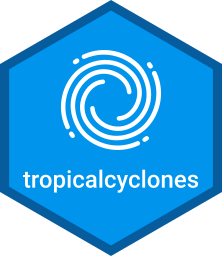

```{r, include = FALSE}
knitr::opts_chunk$set(
  collapse = TRUE,
  comment = "#>",
  fig.path = "man/figures/README-"
)
```
# tropicalcyclones 

<!-- badges: start -->
[](https://www.tidyverse.org/lifecycle/#experimental)
[](https://cran.r-project.org/package=tropicalcyclones)
[](https://aldomann.github.io/maroikart/)
<!-- badges: end -->

## Overview

Parse and explore data from several tropical-cyclone related databases, such as HURDAT2, HadISST1, and OISST.


## Installation

<!-- You can install the released version of tropicalcyclones from [CRAN](https://CRAN.R-project.org) with: -->

<!-- ``` r -->
<!-- install.packages("tropicalcyclones") -->
<!-- ``` -->

<!-- And  -->
The development version can be installed from [GitHub](https://github.com/) with:

``` r
# install.packages("devtools")
devtools::install_github("aldomann/tropicalcyclones")
```
## Examples

Since `read_hurdat2()` is powered by `readLines`, we can use any connection, such as

- Local files.
- Compressed files.
- Remote URLs.

```r
hurr_obs_natl <- tropicalcyclones::read_hurdat2("hurdat2-1851-2016-apr2017.txt")
```

```r
hurr_obs_natl <- tropicalcyclones::read_hurdat2("https://www.aoml.noaa.gov/hrd/hurdat/hurdat2.html")
```

